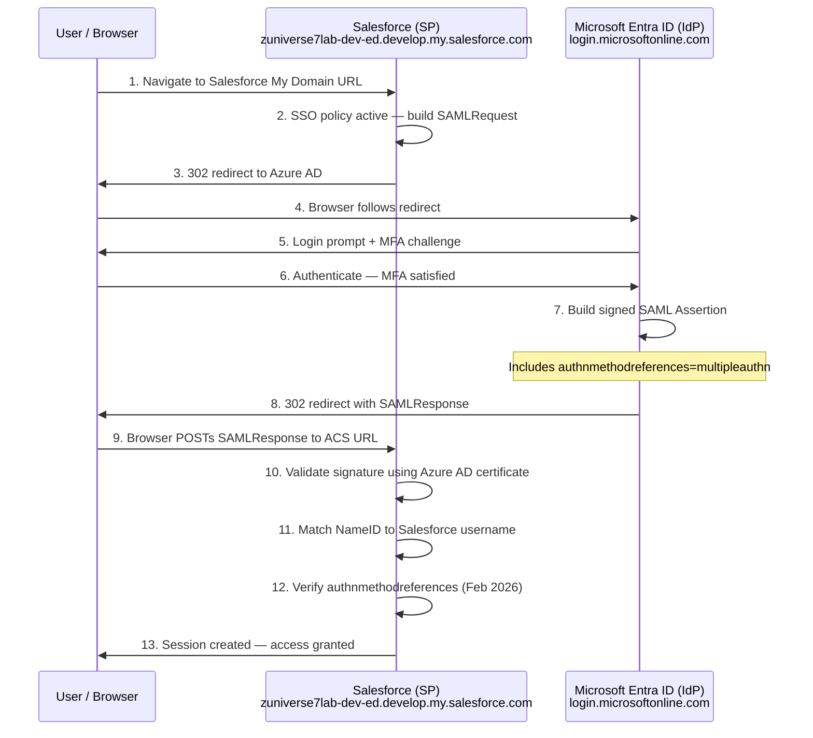

## Lab 5 — SAML SSO: Microsoft Entra ID + Salesforce Developer Edition

**Microsoft Entra ID (IdP) → Salesforce Developer Edition (SP) — SAML 2.0 Federation**

---

## Objective

This lab configures SAML 2.0 Single Sign-On between Microsoft Entra ID and Salesforce Developer Edition. Salesforce is one of the most widely deployed SaaS platforms in enterprise environments globally — including Australian banking, insurance, and financial services — making this a highly relevant integration for IAM engineers and BAs.

By the end of this lab you will understand:

- How to configure SAML SSO between Azure AD and a real enterprise SaaS platform
- How Salesforce handles SAML configuration via metadata file upload
- What My Domain is in Salesforce and why it is required for SSO
- How SAML JIT (Just-in-Time) provisioning works
- How to inspect and explain every field in a SAML assertion
- How the `user.mail` vs `user.userprincipalname` attribute decision affects SSO
- How to use SAML Tracer to diagnose real assertion issues
- Important February 2026 Salesforce device activation changes affecting SSO

---

## Environment

| Component | Role | Product |
|---|---|---|
| Identity Provider (IdP) | Authenticates users, issues SAML assertions | Microsoft Entra ID (Azure AD) |
| Service Provider (SP) | The application being accessed | Salesforce Developer Edition |
| Protocol | Federation standard | SAML 2.0 |
| Lab domain | Azure AD tenant | `zuniverse7.onmicrosoft.com` |
| Diagnostic Tool | SSO debugging | SAML Tracer browser extension |

---

## Why Salesforce for This Lab

Salesforce is used by virtually every large enterprise globally for CRM, sales, service, and business operations. In the Australian market it is standard across banking (NAB, ANZ, CBA), insurance, and government. Key reasons this lab is valuable:

- Salesforce's metadata file upload approach is different from ServiceNow — instead of manually entering each field, you upload the Federation Metadata XML and Salesforce auto-populates everything
- Salesforce uses My Domain — a custom subdomain that must be configured before SSO is possible
- Salesforce supports SAML JIT provisioning natively — users can be created on first login without pre-provisioning
- The troubleshooting experience using SAML Tracer directly applies to production enterprise SSO issues
- Salesforce Developer Edition is permanently free — no trial expiry pressure

---

## Important: February 2026 Salesforce Device Activation Change

Starting February 3, 2026, Salesforce enforced device activation changes for SSO logins. Salesforce now accepts the `authnmethodreferences` claim included by default in SAML tokens issued by Entra ID. If the `authnmethodreferences` claim contains the value `multipleauthn`, Salesforce treats the device as trusted.

This means MFA must be configured in Azure AD for your test user. When MFA is satisfied, Entra ID automatically includes `multipleauthn` in the assertion and Salesforce accepts the login without triggering a device activation prompt.

> For your lab: ensure your test user has MFA registered in Azure AD before testing SSO. This is the most common reason SSO appears to work but Salesforce still blocks login on developer instances in 2026.

---

## Architecture Overview

```
User / Browser
      │
      ▼
Salesforce Developer Edition (SP)
<subdomain>-dev-ed.develop.my.salesforce.com
      │  (1. User accesses Salesforce My Domain URL)
      │  (2. Salesforce detects SSO policy — builds SAMLRequest)
      │  (3. 302 redirect to Azure AD)
      ▼
Microsoft Entra ID (IdP)
login.microsoftonline.com
      │  (4. User authenticates — MFA required)
      │  (5. Entra builds signed SAML Assertion)
      │  (6. 302 redirect with SAMLResponse)
      ▼
Salesforce ACS URL
      │  (7. Salesforce validates signature using Azure AD certificate)
      │  (8. Matches NameID to Salesforce username)
      │  (9. Session created)
      ▼
User granted access to Salesforce
```

---

## Key Concepts

### My Domain

Salesforce requires a custom subdomain called My Domain before SSO can be configured. This gives your Salesforce org a unique URL like:

```
https://zuniverse7lab-dev-ed.develop.my.salesforce.com
```

My Domain is required because SSO configuration is domain-specific — Salesforce needs a stable, unique URL to route authentication requests through. Without it, the SSO configuration options are not available in Setup.

In production Salesforce deployments, My Domain is always configured. It also enables Lightning Experience, branded login pages, and AppExchange packages — so it is a prerequisite for much more than just SSO.

### Federation Metadata XML vs Manual Configuration

Unlike ServiceNow where we manually entered each endpoint, Salesforce uses a metadata file upload approach:

1. Download the Federation Metadata XML from Azure AD
2. Upload it to Salesforce
3. Salesforce auto-populates all SAML fields — endpoints, Entity ID, certificate

This is cleaner, faster, and less error-prone than manual entry. It is the same metadata exchange concept from Lab 0 (AD FS) but applied at the application level.

### SAML Identity Type

Salesforce has two options for matching the incoming assertion to a user:

| SAML Identity Type | What it matches | Use case |
|---|---|---|
| Assertion contains the User's Salesforce username | NameID = Salesforce username | Standard SSO without JIT |
| Assertion contains the Federation ID from the User object | NameID = Federation ID field | JIT provisioning |

For this lab we use Assertion contains the User's Salesforce username — the NameID in the assertion must match the Salesforce username exactly.

### SAML JIT Provisioning

JIT provisioning automatically creates a Salesforce user record on first successful SSO login — no pre-provisioning required. For this lab we keep it simple and pre-create the test user manually, but JIT is worth understanding for interviews. To enable it, select User Provisioning Enabled and set SAML Identity Type to Assertion contains the Federation ID from the User object.

### The user.mail vs user.userprincipalname Decision

This is the same issue encountered in Lab 3 (ServiceNow). On `onmicrosoft.com` tenant accounts without Microsoft 365, the `user.mail` attribute is not populated by Azure AD. Using it would send a blank NameID to Salesforce. The UPN (`user.userprincipalname`) is always populated and should be used for lab environments.

---

## Prerequisites

- Microsoft Entra ID free tier tenant (`zuniverse7.onmicrosoft.com`)
- Salesforce Developer Edition account — sign up at `https://developer.salesforce.com/signup`
- SAML Tracer browser extension installed
- Test user in Azure AD: `Goten@zuniverse7.onmicrosoft.com` with MFA registered
- Test user assigned to the Salesforce Enterprise App in Azure AD

---

## Lab Steps

---

### Part 1 — Set Up Salesforce Developer Edition

**Step 1 — Sign Up for Salesforce Developer Edition**

Go to:
```
https://developer.salesforce.com/signup
```

Fill in the form using your real email address — this is where the verification email goes and becomes your Salesforce admin login.

| Field | Value |
|---|---|
| First Name | Your name |
| Last Name | Your name |
| Email | Your real Gmail or personal email |
| Username | Must be email format — use something like `francis.lab@zuniverse7.dev` |
| Company | `ZUniverse7 Lab` |
| Country | Australia |

Check your email and click the verification link to activate your org.


📸 *Screenshot: Salesforce org activated — developer home page*


**Step 2 — Set Up My Domain**

My Domain is required before SSO can be configured.

1. In Salesforce, click the gear icon → **Setup**
2. In the Quick Find search box, type `My Domain`
3. Select **My Domain** under Company Settings
4. Choose a subdomain name — e.g. `zuniverse7lab`
5. Click **Check Availability** then **Register Domain**
6. Wait for the domain to be provisioned — usually a few minutes
7. Click **Log In** to switch to your new My Domain URL

Your Salesforce URL will now be:
```
https://zuniverse7lab-dev-ed.develop.my.salesforce.com
```

> Without My Domain, the Single Sign-On Settings page does not show SAML configuration options. My Domain must be active before proceeding.


📸 *Screenshot: My Domain registered and active — new URL shown*


---

### Part 2 — Configure Azure AD

**Step 3 — Add Salesforce from the Entra Gallery**

1. Sign into `https://entra.microsoft.com`
2. Go to **Entra ID → Enterprise Applications → New Application**
3. Search for **Salesforce**
4. Select **Salesforce** from the gallery and click **Add**

Using the gallery version is important — it includes pre-configured claim mappings that match what Salesforce expects.


📸 *Screenshot: Salesforce Enterprise App created in Entra*


---

**Step 4 — Configure Basic SAML Settings in Azure AD**

Navigate to **Single Sign-On → SAML** in the Salesforce Enterprise App.

In the Basic SAML Configuration section, enter the values for your Developer account:

| Field | Value |
|---|---|
| Identifier (Entity ID) | `https://<subdomain>-dev-ed.develop.my.salesforce.com` |
| Reply URL (ACS URL) | `https://<subdomain>-dev-ed.develop.my.salesforce.com` |
| Sign-on URL | `https://<subdomain>-dev-ed.develop.my.salesforce.com` |

Replace `<subdomain>` with your actual My Domain subdomain.

> For Salesforce Developer Edition the Identifier, Reply URL, and Sign-on URL are all the same value — your My Domain URL. This differs from ServiceNow where each URL was distinct.

📸 *Screenshot: Azure AD Basic SAML Configuration — Salesforce My Domain URL entered*


---

**Step 5 — Configure Attributes and Claims**

In **Attributes and Claims → Edit**, configure the Unique User Identifier:

| Field | Value |
|---|---|
| Name identifier format | `Email address` |
| Source attribute | `user.userprincipalname` |

> Use `user.userprincipalname` not `user.mail`. On `onmicrosoft.com` tenant accounts without Microsoft 365, the `user.mail` attribute is not populated — sending a blank NameID to Salesforce. This is the same issue diagnosed in Lab 3.

📸 *Screenshot: Unique User Identifier — user.userprincipalname selected*

📸 *Screenshot: Final Attributes and Claims configuration*


---

**Step 6 — Download the Federation Metadata XML**

In the **SAML Signing Certificate** section, click **Download** next to **Federation Metadata XML**.

Save this file — you will upload it to Salesforce in the next part.

> The metadata XML contains everything Salesforce needs — the signing certificate, SAML endpoints (Login URL, Logout URL), and the Issuer/Entity ID — all in one file. Salesforce reads this file and auto-populates all SAML fields, avoiding the manual copy-paste errors experienced in previous labs.

📸 *Screenshot: Federation Metadata XML download link in Azure AD*

---

**Step 7 — Assign Test User to Enterprise App**

In the Salesforce Enterprise App go to **Users and Groups → Add user/group**:

1. Add `Goten@zuniverse7.onmicrosoft.com`
2. Save

> Azure AD will refuse to issue a SAML assertion for any user not assigned to the Enterprise Application. This applies to every SAML lab.

📸 *Screenshot: Test user Goten assigned to Salesforce Enterprise App*


---

### Part 3 — Configure Salesforce SSO

**Step 8 — Enable SAML in Salesforce**

1. In Salesforce, click gear icon → **Setup**
2. In Quick Find, type `Single Sign-On`
3. Select **Single Sign-On Settings**
4. Click **Edit**
5. Check **SAML Enabled**
6. Click **Save**

> Salesforce has SAML disabled by default. Enabling it unlocks the New from Metadata File option. Without this step the SAML SSO configuration options are not available.

📸 *Screenshot: Single Sign-On Settings page — SAML Enabled checkbox ticked*

---

**Step 9 — Upload Federation Metadata XML**

1. Still on Single Sign-On Settings, click **New from Metadata File**
2. Click **Choose File** and select the Federation Metadata XML downloaded from Azure AD
3. Click **Create**

Salesforce reads the XML and auto-populates all SAML fields:
- Issuer (Azure AD Entity ID)
- Identity Provider Login URL
- Identity Provider Certificate
- Entity ID

📸 *Screenshot: New from Metadata File button selected*

📸 *Screenshot: Federation Metadata XML uploaded — Choose File dialog*

📸 *Screenshot: SAML SSO settings auto-populated after XML upload*


---

**Step 10 — Configure SAML Identity Type and Save**

After the metadata upload, on the SAML Single Sign-On Settings page:

| Field | Value |
|---|---|
| SAML Identity Type | `Assertion contains the User's Salesforce username` |
| User Provisioning Enabled | unchecked |

Click **Save**.

> Using the Salesforce username as the matching field is the simpler approach. The NameID in the Azure AD assertion must match the Salesforce username exactly — we configure this match in Step 12.

📸 *Screenshot: SAML Identity Type set to User's Salesforce username — saved*

---

**Step 11 — Configure My Domain Authentication**

1. In Quick Find, type `My Domain`
2. Select **My Domain**
3. Scroll to **Authentication Configuration** → click **Edit**
4. Check both:
   - Login Page — keeps local login available as fallback
   - AzureSSO — the SAML config created from the XML upload
5. Click **Save**

> Always keep Login Page checked. Unchecking it removes local admin login — creating a lockout risk identical to the ServiceNow Auto Redirect IdP issue that caused instance wipes in Lab 3.

📸 *Screenshot: My Domain Authentication Configuration — Login Page and AzureSSO both checked*


---

### Part 4 — Create Salesforce Test User

**Step 12 — Create Test User in Salesforce**

The Salesforce username must exactly match the NameID being sent by Azure AD.

1. In Salesforce Setup, go to **Administration → Users → Users**
2. Click **New User**

| Field | Value |
|---|---|
| First Name | Goten |
| Last Name | Test |
| Email | Your real Gmail |
| Username | `Goten@zuniverse7.onmicrosoft.com` |
| User Licence | Salesforce |
| Profile | Standard User |

3. Click **Save**

> The Username field is the critical one — it must be `Goten@zuniverse7.onmicrosoft.com` exactly. This is what Salesforce matches against the NameID in the SAML assertion. Any mismatch causes a silent login failure.

📸 *Screenshot: New User form in Salesforce — username set to Goten@zuniverse7.onmicrosoft.com*

📸 *Screenshot: Test user created in Salesforce Users list*


---

### Part 5 — Test SSO

**Step 13 — Open SAML Tracer**

Open SAML Tracer in your browser before testing so you can inspect the assertion in real time.

📸 *Screenshot: SAML Tracer open and ready*

---

**Step 14 — Test SSO Login**

In the Salesforce Enterprise App in Azure AD, scroll to the bottom of the SAML SSO page and click **Test**.

Alternatively, test SP-initiated by navigating directly to your My Domain URL:
```
https://<subdomain>-dev-ed.develop.my.salesforce.com
```

📸 *Screenshot: Azure AD Test button on Salesforce SAML SSO page*

---

**Step 15 — Inspect the SAML Assertion in SAML Tracer**

In SAML Tracer, click the orange POST request to the Salesforce ACS URL and open the **SAML** tab.

Verify each field:

| Field | Expected Value | Why It Matters |
|---|---|---|
| `StatusCode` | `urn:oasis:names:tc:SAML:2.0:status:Success` | Azure AD processed the request successfully |
| `NameID` | `Goten@zuniverse7.onmicrosoft.com` | Must match Salesforce username exactly |
| `NameID Format` | `urn:oasis:names:tc:SAML:1.1:nameid-format:emailAddress` | Must match Salesforce expectation |
| `Issuer` | `https://sts.windows.net/<tenant-id>/` | Identifies Azure AD — Salesforce verifies this |
| `Audience` | Your Salesforce My Domain URL | Locks assertion to your org — prevents replay attacks |
| `NotOnOrAfter` | Future timestamp | Assertion validity window |
| `Signature` | Present | Cryptographic proof from Azure AD |
| `authnmethodreferences` | `multipleauthn` | Required by Salesforce from Feb 2026 — confirms MFA satisfied |

📸 *Screenshot: SAML Tracer — full assertion XML with NameID and StatusCode visible*


📸 *Screenshot: SAML Tracer — authnmethodreferences claim showing multipleauthn*


---

**Step 16 — Confirm Successful Login**


After SSO completes you should be logged into Salesforce as Goten. Verify:

- Top right corner shows Goten's name
- URL is your My Domain URL
- No device activation prompt appeared

📸 *Screenshot: Salesforce home page — logged in as Goten via SSO*


---

## Authentication Flow Diagram



---

## SAML Assertion Deep Dive

Being able to read and explain a SAML assertion is a core IAM engineer skill. Here is what the Azure AD to Salesforce assertion looks like with every field annotated:

```xml
<samlp:Response>

  <!-- Where the assertion is posted — must match Salesforce ACS URL -->
  <Destination>https://zuniverse7lab-dev-ed.develop.my.salesforce.com</Destination>

  <!-- Overall status — Success means Azure AD processed the request -->
  <StatusCode Value="urn:oasis:names:tc:SAML:2.0:status:Success"/>

  <Assertion>

    <!-- Who issued this assertion — Azure AD tenant -->
    <Issuer>https://sts.windows.net/<tenant-id>/</Issuer>

    <!-- The user being authenticated -->
    <!-- Must match Salesforce username EXACTLY -->
    <NameID Format="urn:oasis:names:tc:SAML:1.1:nameid-format:emailAddress">
      Goten@zuniverse7.onmicrosoft.com
    </NameID>

    <Conditions NotBefore="..." NotOnOrAfter="...">

      <!-- Locks assertion to this specific Salesforce org -->
      <!-- Prevents replay attacks against other applications -->
      <Audience>https://zuniverse7lab-dev-ed.develop.my.salesforce.com</Audience>

    </Conditions>

    <AttributeStatement>

      <!-- Required from Feb 2026 — confirms MFA was completed -->
      <Attribute Name="authnmethodreferences">
        <AttributeValue>multipleauthn</AttributeValue>
      </Attribute>

      <Attribute Name="givenname">
        <AttributeValue>Goten</AttributeValue>
      </Attribute>

      <Attribute Name="surname">
        <AttributeValue>Test</AttributeValue>
      </Attribute>

      <Attribute Name="emailaddress">
        <AttributeValue>Goten@zuniverse7.onmicrosoft.com</AttributeValue>
      </Attribute>

    </AttributeStatement>

    <!-- Signed with Azure AD private key -->
    <!-- Salesforce verifies using public certificate from metadata XML -->
    <Signature>
      <SignatureMethod Algorithm="rsa-sha256"/>
      <SignatureValue>...</SignatureValue>
    </Signature>

  </Assertion>
</samlp:Response>
```

---

## Troubleshooting Reference

| Symptom | Likely Cause | Resolution |
|---|---|---|
| Salesforce prompts for device activation after SSO | MFA not satisfied — `authnmethodreferences` missing `multipleauthn` | Ensure test user has MFA registered in Azure AD and MFA was completed |
| `AADSTS50011` — Reply URL mismatch | My Domain URL in Azure doesn't exactly match Salesforce URL | Update Identifier, Reply URL, Sign-on URL in Azure to match exact My Domain URL |
| SSO completes but Salesforce shows user not found | Salesforce username doesn't match NameID | Ensure Salesforce username is exactly `Goten@zuniverse7.onmicrosoft.com` |
| NameID is blank in SAML Tracer | `user.mail` attribute is empty on lab account | Switch Unique User Identifier to `user.userprincipalname` in Azure AD claims |
| Signature validation failed | Wrong or expired certificate in Salesforce | Re-download Federation Metadata XML from Azure and re-upload to Salesforce |
| SSO option not showing on Salesforce login page | AzureSSO not added to Authentication Configuration | Go to My Domain → Authentication Configuration → add AzureSSO |
| Local login disappeared after enabling SSO | Login Page unchecked in Authentication Configuration | Go to My Domain → Authentication Configuration → re-check Login Page |

---

## Key Differences: Salesforce vs ServiceNow SAML SSO

| Aspect | ServiceNow (Lab 3) | Salesforce (Lab 5) |
|---|---|---|
| Plugin required | Yes — Multi-Provider SSO plugin | No — SAML built into Setup |
| Configuration method | Manual field entry or metadata URL import | Federation Metadata XML file upload |
| Lockout risk | High — Auto Redirect IdP disables side_door.do | Low — Login Page option always kept enabled |
| User matching field | Configurable — email or user_name | Salesforce username field |
| JIT provisioning | Requires plugin setting | Built-in — enable User Provisioning in SAML settings |
| My Domain required | No | Yes — hard prerequisite |
| Feb 2026 consideration | Not applicable | authnmethodreferences=multipleauthn required |

---

## Key Learnings

- Salesforce requires My Domain before SSO can be configured — this is a hard prerequisite unique to Salesforce
- The Federation Metadata XML upload approach is cleaner than manual field entry — Salesforce auto-populates all SAML settings from the file
- The Salesforce username field must exactly match the NameID in the SAML assertion — case sensitive
- `user.userprincipalname` must be used for lab accounts on `onmicrosoft.com` tenants without Microsoft 365 — `user.mail` is not populated
- From February 2026, Salesforce requires MFA to be satisfied for SSO logins — the `authnmethodreferences=multipleauthn` claim must be present in the assertion
- Always keep Login Page checked in Salesforce Authentication Configuration — removing it creates a lockout risk identical to the ServiceNow Auto Redirect IdP issue
- SAML Tracer is the essential diagnostic tool — the `authnmethodreferences` claim, NameID value, and Audience restriction are all visible and verifiable in real time

---

## Interview Questions

**What is Salesforce My Domain and why is it required for SSO?**
My Domain is a custom subdomain that gives a Salesforce org a unique URL. It is required for SSO because SAML configuration is domain-specific — the ACS URL, Entity ID, and authentication routing all depend on a stable unique domain. Without My Domain, SAML configuration options are not available in Salesforce Setup.

**What is the difference between SAML metadata file upload and manual SAML configuration?**
Manual configuration requires individually copying each SAML value — Login URL, Logout URL, Entity ID, and certificate — between the IdP and SP. Metadata file upload provides all of these in a single XML file that the SP reads and uses to auto-populate all fields. It is faster, less error-prone, and the approach recommended by both Microsoft and Salesforce.

**What changed with Salesforce SSO in February 2026?**
Salesforce enforced device activation requirements for SSO logins. The SAML assertion must include an `authnmethodreferences` claim containing `multipleauthn`, indicating MFA was completed. Microsoft Entra ID automatically includes this claim when MFA is satisfied, so configuring MFA for SSO users resolves this requirement.

**Why would a Salesforce SSO login fail even though the SAML assertion shows StatusCode Success?**
Authentication and authorisation are separate stages. A successful StatusCode means Azure AD generated an assertion, but Salesforce must still match the NameID to an existing username in its user directory. If the NameID doesn't match any Salesforce username exactly, or if the `authnmethodreferences` claim is missing, Salesforce rejects the login after the assertion is received.

**What is SAML JIT provisioning in Salesforce?**
Just-in-Time provisioning automatically creates a Salesforce user record on first successful SSO login without pre-provisioning. It is enabled by setting SAML Identity Type to Assertion contains the Federation ID from the User object and enabling User Provisioning in SAML settings. In production it is combined with SCIM provisioning for full user lifecycle management.

**What is the Audience restriction in a SAML assertion and why does it matter?**
The Audience element specifies which Service Provider the assertion is intended for, using the SP's Entity ID. If the SP's Entity ID doesn't match the Audience value, the SP rejects the assertion even if the signature is valid. This prevents replay attacks where an assertion issued for one application is reused against a different one.

---

## References

- [Microsoft Entra — Configure Salesforce SSO](https://learn.microsoft.com/en-us/entra/identity/saas-apps/salesforce-tutorial)
- [Salesforce Help — Configure SSO with Salesforce as SAML Service Provider](https://help.salesforce.com/s/articleView?id=xcloud.sso_saml.htm&type=5)
- [Salesforce Help — My Domain Setup](https://help.salesforce.com/s/articleView?id=sf.domain_name_overview.htm&type=5)
- [Salesforce — February 2026 Device Activation SSO Changes](https://help.salesforce.com/s/articleView?id=005237070&type=1)
- [Microsoft — SAML Token Claims Reference](https://learn.microsoft.com/en-us/entra/identity-platform/reference-saml-tokens)
- [SAML 2.0 Specification — OASIS](https://docs.oasis-open.org/security/saml/v2.0/)
