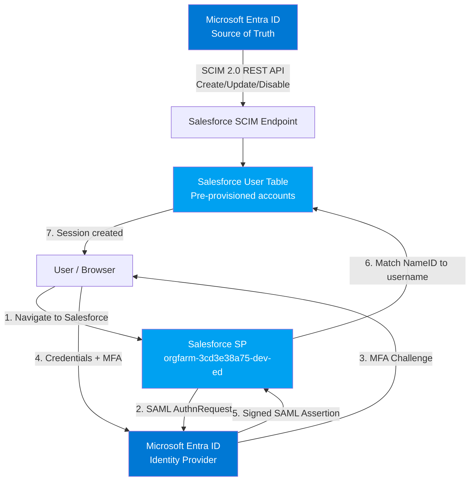

# Lab 6 — SCIM User Provisioning: Microsoft Entra ID + Salesforce

**Automated User Lifecycle Management — Entra ID (SCIM Client) → Salesforce (SCIM Server)**

> **Prerequisite:** Lab 5 (SAML SSO — Salesforce) must be completed first. This lab extends the same Salesforce Enterprise App with automated provisioning.

---

## Objective

This lab configures automated SCIM-based user provisioning between Microsoft Entra ID and Salesforce Developer Edition. While Lab 5 covered authentication (who are you), this lab covers the identity lifecycle (when and how accounts are created, updated, and deprovisioned).

By the end of this lab you will understand:

- What SCIM is and how it works as a protocol
- How Entra ID acts as a SCIM client to push user lifecycle events to Salesforce
- Why SCIM provisioning is preferred over JIT in regulated environments like banking
- How to read and interpret Entra provisioning logs
- How attribute mappings control what data flows from Entra to Salesforce
- What a Salesforce Security Token is and why it is needed
- How on-demand provisioning works for testing
- The full enterprise pattern: SCIM for lifecycle + SAML for authentication

---

## Why This Lab Matters for IAM/PAM Professionals

In your previous labs, users had to be manually created in Salesforce before SSO would work. In enterprise environments with hundreds or thousands of users, manual provisioning is not scalable and creates governance gaps.

<cite index="26-1">SCIM is an open standard that allows for the automation of user provisioning. SCIM communicates user identity data between identity providers and service providers. Microsoft is an example of an identity provider. Salesforce is an example of a service provider. Service providers require user identity information and an identity provider fulfills that need. SCIM is the mechanism the identity provider and service provider use to send information back and forth.</cite>

**The governance argument — why SCIM beats JIT in regulated environments:**

| Scenario | JIT Provisioning | SCIM Provisioning |
|---|---|---|
| When is the account created? | First login — no approval needed | When assigned in Entra — requires explicit assignment |
| Audit trail? | Login timestamp only | Full lifecycle log — created, modified, deprovisioned with timestamps |
| Access approval? | None — anyone with SSO can get an account | Yes — must be assigned to the app in Entra first |
| Deprovisioning? | Manual — account persists after user leaves | Automatic — remove assignment → account disabled in Salesforce |
| APRA CPS 234 / ISO 27001 friendly? | No | Yes |
| Works if SSO is broken? | No — needs SSO to trigger account creation | Yes — account exists independently of authentication |

This is why Australian banks and financial institutions use SCIM + SSO together rather than JIT. SCIM satisfies the joiner/mover/leaver governance requirements that regulators expect.

---

## SCIM Protocol Fundamentals

Understanding SCIM at the protocol level is what separates an IAM engineer from someone who just clicks through a configuration wizard.

### SCIM is a REST API

SCIM uses standard HTTP methods against standard endpoints:

| HTTP Method | SCIM Endpoint | What Entra Does | When |
|---|---|---|---|
| `POST` | `/scim/v2/Users` | Creates a new user | User assigned to app in Entra |
| `GET` | `/scim/v2/Users?filter=...` | Checks if user exists | Before creating — prevents duplicates |
| `PATCH` | `/scim/v2/Users/{id}` | Updates user attributes | Attribute change in Entra |
| `DELETE` / `PATCH active=false` | `/scim/v2/Users/{id}` | Deprovisions user | User unassigned or disabled in Entra |

### What a SCIM Request Looks Like

When Entra creates a user in Salesforce via SCIM, it sends a JSON payload like this:

```json
POST /scim/v2/Users HTTP/1.1
Host: orgfarm-3cd3e38a75-dev-ed.develop.my.salesforce.com
Authorization: Bearer <token>
Content-Type: application/scim+json

{
  "schemas": ["urn:ietf:params:scim:schemas:core:2.0:User"],
  "userName": "Goten@zuniverse7.onmicrosoft.com",
  "name": {
    "givenName": "Goten",
    "familyName": "Test"
  },
  "emails": [{
    "value": "Goten@zuniverse7.onmicrosoft.com",
    "primary": true
  }],
  "active": true
}
```

Salesforce receives this, creates the user, and responds with the created user object including a Salesforce-assigned ID.

### The Provisioning Cycle

Entra ID does not provision in real time for every change — it runs a **provisioning cycle** on a schedule:

| Cycle Type | Frequency | What it does |
|---|---|---|
| Initial cycle | Once — on first enable | Syncs all assigned users to Salesforce |
| Incremental cycle | Every 40 minutes | Syncs only changes since last cycle |
| On-demand | Manual trigger | Immediately provisions a specific user — used for testing |

---

## Architecture

### Lab 5 (SAML SSO only)
```
User → Salesforce → Azure AD → SAML Assertion → Salesforce ✅
                                                  (user must already exist)
```

### Lab 6 (SCIM + SAML — full enterprise pattern)
```
Entra ID (Source of Truth)
├── SCIM Provisioning → Salesforce (lifecycle — create/update/deprovision)
└── SAML SSO → Salesforce (authentication — login)

Result: User is pre-provisioned before first login
        Full audit trail exists from assignment to deprovisioning
        Deprovisioning is automatic when access is removed
```

---

## Environment

| Component | Role | Product |
|---|---|---|
| SCIM Client | Initiates provisioning API calls | Microsoft Entra ID |
| SCIM Server | Receives and processes provisioning requests | Salesforce Developer Edition |
| Protocol | Identity lifecycle standard | SCIM 2.0 (RFC 7643/7644) |
| Authentication method | How Entra authenticates to Salesforce SCIM API | Salesforce Security Token |
| Provisioning logs | Where to monitor and troubleshoot | Entra ID Provisioning Logs |

---

## Prerequisites

- Lab 5 completed — Salesforce Enterprise App already exists in Entra ID
- Salesforce Developer Edition org active (`orgfarm-3cd3e38a75-dev-ed.develop.my.salesforce.com`)
- Salesforce admin account credentials
- Access to the email associated with your Salesforce admin account (needed for Security Token)

> <cite index="29-1">If you are using a Salesforce.com trial account, then you will be unable to configure automated user provisioning. Trial accounts do not have the necessary API access enabled until they are purchased. You can get around this limitation by using a free developer account.</cite>
>
> This is why we chose Salesforce Developer Edition in Lab 5 — not just for SSO but for provisioning too.

---

## Key Concepts Before Starting

### What is a Salesforce Security Token?

The Security Token is a Salesforce-specific authentication mechanism required when connecting to Salesforce APIs from outside a trusted IP range. When Entra ID connects to the Salesforce SCIM endpoint, it authenticates using your admin username, password, and security token combined.

> **Important:** Every time you reset your Salesforce admin password, Salesforce generates a new Security Token and emails it to you. If you reset your password after completing this lab, you must update the token in Entra or provisioning will stop working.

### What is Attribute Mapping?

Attribute mapping defines which Entra ID user attributes flow to which Salesforce fields. Entra has a set of default mappings for Salesforce that cover the essential fields, but you can customise them.

| Entra ID Attribute | Salesforce Field | Notes |
|---|---|---|
| `userPrincipalName` | `userName` | Primary matching attribute |
| `mail` | `emails[primary].value` | Email address |
| `givenName` | `name.givenName` | First name |
| `surname` | `name.familyName` | Last name |
| `department` | `department` | Department |
| `jobTitle` | `title` | Job title |
| `active` | `active` | Controls account enabled/disabled state |

### What is the Matching Attribute?

The matching attribute is how Entra determines if a user already exists in Salesforce before creating a new one. By default this is `userPrincipalName` → `userName`. Entra queries Salesforce's SCIM endpoint before every create to check if the user already exists — preventing duplicates.

---

## Lab Steps

---

### Part 1 — Get the Salesforce Security Token

**Step 1 — Reset and Retrieve Your Security Token**

<cite index="32-1">To get your Salesforce security token, open a new tab and sign into the same Salesforce admin account. On the top right corner of the page, select your name, and then select Settings.</cite>

Create SCIM service Account:
In Salesforce go to Setup → Administration → Users → New User and create:

Field	Value
First Name	SCIM
Last Name	Integration
Email	Your real Gmail
Username	scim.integration@zuniverse7.dev
User Licence	Salesforce
Profile	System Administrator (or a custom profile with API Enabled + Manage Users)

Then generate the Security Token from that account and use those credentials in Entra.

1. Log into your Salesforce Developer org
2. Click your name/avatar in the top right → **Settings**
3. In the left navigation, expand **My Personal Information**
4. Click **Reset My Security Token**
5. Click **Reset Security Token** button

📸 *Screenshot: Salesforce Settings — My Personal Information → Reset My Security Token*

📸 *Screenshot: Reset Security Token confirmation page*

<cite index="32-1">Check the email inbox associated with this admin account. Look for an email from Salesforce.com that contains the new security token.</cite>

6. Check the email associated with your Salesforce admin account
7. Copy the security token from the email — save it somewhere safe

📸 *Screenshot: Salesforce security token email received*

> **Keep this token safe** — you will paste it into Entra in the next section. It will not be shown again. If you lose it, repeat this step to generate a new one.

---

### Part 2 — Configure Provisioning in Entra ID

**Step 2 — Open the Salesforce Enterprise App**

<cite index="32-1">Sign in to the Microsoft Entra admin center. Browse to Entra ID → Enterprise apps. If you have configured Salesforce for single sign-on, search for your instance of Salesforce using the search field.</cite>

1. Sign into `https://entra.microsoft.com`
2. Go to **Entra ID → Enterprise Applications**
3. Search for and open your **Salesforce** app from Lab 5

📸 *Screenshot: Salesforce Enterprise App open in Entra — Provisioning tab visible in left menu*

---

**Step 3 — Enable Automatic Provisioning**

1. Click **Provisioning** in the left menu
2. Click **+ New configuration**
3. Set **Provisioning Mode** to **Automatic**

📸 *Screenshot: Provisioning Mode set to Automatic*

---

**Step 4 — Configure Admin Credentials**

<cite index="32-1">Under the Admin Credentials section, provide the following configuration settings: In the Admin Username textbox, type a Salesforce account name that has the System Administrator profile in Salesforce.com assigned. In the Admin Password textbox, type the password for this account.</cite>

In the **Admin Credentials** section:

| Field | Value |
|---|---|
| Admin Username | Your Salesforce admin email/username |
| Admin Password | Your Salesforce admin password |
| Secret Token | The security token from Step 1 |
| Tenant URL | `https://orgfarm-3cd3e38a75-dev-ed.develop.my.salesforce.com` |

> **Why the Security Token is needed:** Salesforce requires the security token when API connections come from outside a trusted IP range. Entra ID's provisioning service connects from Microsoft's cloud infrastructure, which is outside your Salesforce org's trusted IPs, so the token is mandatory.

📸 *Screenshot: Admin Credentials section — username, password, secret token and tenant URL entered*

---

**Step 5 — Test Connection**

Click **Test Connection**.

Entra ID will attempt to authenticate to the Salesforce SCIM endpoint using your credentials. A successful test confirms:
- Credentials are correct
- The Security Token is valid
- Entra can reach the Salesforce SCIM API
- The admin account has API access enabled

📸 *Screenshot: Test Connection — success message*

> **If test connection fails**, check:
> - Security token is correct — no spaces or extra characters
> - Admin account has **API Enabled** permission in its Salesforce profile
> - Password hasn't been reset since generating the token (resetting password invalidates the token)

---

**Step 6 — Save and Create Configuration**

Click **Create** to save the provisioning configuration.

📸 *Screenshot: Provisioning configuration created — Overview page*

---

**Step 7 — Review Attribute Mappings**

Click **Attribute Mapping** in the left panel then click **Users** to see how Entra attributes map to Salesforce fields.

<cite index="32-1">Review the user attributes that are synchronized from Microsoft Entra ID to Salesforce. Note that the attributes selected as Matching properties are used to match the user accounts in Salesforce for update operations.</cite>

Key mappings to verify:

| Entra Attribute | Salesforce Attribute | Matching? |
|---|---|---|
| `userPrincipalName` | `userName` | ✅ Yes — primary match |
| `mail` | `emails[primary].value` | No |
| `givenName` | `name.givenName` | No |
| `surname` | `name.familyName` | No |
| `Switch([IsSoftDeleted]...)` | `active` | No — controls deprovisioning |

> **The `active` mapping is critical for deprovisioning.** When a user is unassigned from the app or disabled in Entra, the `active` attribute is set to `false` and Entra sends a PATCH request to Salesforce to disable the account. This is the automated deprovisioning that makes SCIM governance-friendly.

📸 *Screenshot: Attribute Mappings — user mappings showing userPrincipalName as matching attribute*

📸 *Screenshot: Active attribute mapping — showing Switch expression for deprovisioning*

---

### Part 3 — Test Provisioning with a Single User

**Step 8 — Use On-Demand Provisioning**

Before enabling provisioning for all assigned users, test with a single user first. <cite index="32-1">Use on-demand provisioning to validate sync with a small number of users before deploying more broadly in your organization.</cite>

1. Go to **Provisioning → Provision on demand**
2. Search for `Goten@zuniverse7.onmicrosoft.com`
3. Click **Provision**

Entra will immediately attempt to provision that single user to Salesforce and show you the result in real time — including the exact SCIM API calls made and the response from Salesforce.

📸 *Screenshot: Provision on demand — Goten selected*

📸 *Screenshot: On-demand provisioning result — success with SCIM operations shown*

> **Why on-demand provisioning is valuable:** It shows you the exact SCIM request payload and Salesforce's response. If something goes wrong, the error is shown immediately rather than waiting 40 minutes for the next provisioning cycle. This is the SCIM equivalent of using SAML Tracer to inspect assertions.

---

**Step 9 — Verify User Created in Salesforce**

In Salesforce, go to **Setup → Administration → Users → Users**.

Verify:
- Goten's account now exists (or was found if already existing)
- Username matches `Goten@zuniverse7.onmicrosoft.com`
- Account is Active

📸 *Screenshot: Salesforce Users list — Goten account showing as Active*

---

### Part 4 — Enable Full Provisioning

**Step 10 — Start Provisioning**

<cite index="32-1">When you are ready to provision, select Start Provisioning from the Overview page.</cite>

1. Go back to **Provisioning → Overview**
2. Click **Start Provisioning**

Entra will begin the initial provisioning cycle — syncing all users assigned to the Salesforce Enterprise App.

📸 *Screenshot: Provisioning Overview — Start Provisioning button*

📸 *Screenshot: Provisioning cycle running — status showing*

---

### Part 5 — Monitor Provisioning Logs

**Step 11 — Review Provisioning Logs**

Go to **Provisioning → Provisioning Logs** to see a full audit trail of every provisioning action.

Each log entry shows:

| Field | What it tells you |
|---|---|
| Date | When the action occurred |
| Identity | Which user was provisioned |
| Action | Create, Update, or Disable |
| Status | Success, Failure, or Skipped |
| Source | Entra ID attribute values sent |
| Target | Salesforce response |

📸 *Screenshot: Provisioning Logs — showing Create action for Goten with Success status*

📸 *Screenshot: Provisioning Log detail — expanded view showing SCIM request and response*

> **The provisioning log is your audit trail.** Every create, update, and deprovision is recorded here with timestamps. This is exactly what APRA CPS 234 and ISO 27001 require — demonstrable evidence of who was provisioned, when, and by what process. This log is what JIT provisioning cannot provide.

---

### Part 6 — Test Deprovisioning

**Step 12 — Test Automatic Deprovisioning**

This is one of the most important governance features — when a user leaves or loses access, their account should be automatically disabled.

1. In Entra ID, go to the Salesforce Enterprise App → **Users and Groups**
2. Select `Goten@zuniverse7.onmicrosoft.com`
3. Click **Remove**

Wait for the next provisioning cycle (up to 40 minutes) or trigger **Provision on demand** for Goten to immediately process the change.

4. Check Salesforce — Goten's account should now be **Inactive**

📸 *Screenshot: Entra — Goten removed from Salesforce app assignment*

📸 *Screenshot: Salesforce — Goten's account showing as Inactive after deprovisioning*

📸 *Screenshot: Provisioning Log — showing Disable action for Goten*

> **Note:** Salesforce deprovisioning disables the account rather than deleting it. This preserves data ownership (records, cases, opportunities) that were associated with the user, which is standard enterprise practice. Deletion is a separate deliberate action.

---

### Part 7 — Test the Full End-to-End Flow

**Step 13 — Re-assign and Test SSO Login**

Re-assign Goten to the Salesforce app in Entra and confirm the full flow:

1. Assign Goten back to the Salesforce Enterprise App in Entra
2. Trigger on-demand provisioning — confirm account re-enabled in Salesforce
3. Open SAML Tracer
4. Navigate to your Salesforce My Domain URL
5. Authenticate via Azure AD (SSO from Lab 5)
6. Confirm you land in Salesforce as Goten

This demonstrates the complete enterprise pattern:

```
Assignment in Entra → SCIM creates account → User logs in via SAML SSO
Removal in Entra → SCIM disables account → User cannot log in via SSO
```

📸 *Screenshot: Full flow — Goten provisioned via SCIM and logged in via SAML SSO*

---

## Complete Architecture — Labs 5 + 6 Combined



**The two flows are independent but complementary:**
- **SCIM** runs on a schedule (every 40 minutes) — manages the lifecycle
- **SAML** runs on every login — manages the authentication
- Together they deliver governed, auditable, automated identity management

---

## SCIM vs JIT vs Manual — Decision Framework

This is a common interview question for IAM roles. Here is how to answer it:

| Factor | Manual | JIT | SCIM |
|---|---|---|---|
| Scale | ❌ Not scalable | ✅ Scales automatically | ✅ Scales automatically |
| Approval workflow | ✅ Can enforce | ❌ No approval | ✅ Assignment = approval |
| Audit trail | ❌ No automatic trail | ❌ Login timestamp only | ✅ Full lifecycle log |
| Deprovisioning | ❌ Manual | ❌ Manual | ✅ Automatic |
| Works without SSO | ✅ Yes | ❌ No | ✅ Yes |
| Regulated industries (APRA, SOX, ISO 27001) | ❌ | ❌ | ✅ |
| Setup complexity | Low | Low | Medium |

**When to use each:**

- **Manual** — small orgs, one-off access, break-glass accounts
- **JIT** — non-regulated SaaS apps where governance is secondary to speed
- **SCIM** — enterprise standard, regulated industries, apps holding sensitive data

---

## Comparing SCIM Implementations — Entra vs SailPoint

Since you have SailPoint experience, this comparison is worth documenting:

| Aspect | Entra ID → Salesforce (this lab) | SailPoint → CyberArk (your experience) |
|---|---|---|
| SCIM server | Native — built into Salesforce | Not native — required dedicated SCIM server/gateway |
| Middleware needed | No | Yes — SCIM server acts as translator |
| Configuration | Entra provisioning tab | SailPoint connector + SCIM gateway |
| Protocol | Standard SCIM 2.0 | SCIM 2.0 via middleware |
| Complexity | Low-Medium | High |
| Why different | Salesforce invested in native SCIM support | CyberArk's API predates SCIM — gateway bridges the gap |

The key insight: **SCIM is the standard, but not every app implements it natively.** When an app doesn't have a native SCIM endpoint (like older versions of CyberArk), a middleware component is needed to translate between the SCIM protocol and the app's proprietary API. This is exactly what the dedicated SCIM server you used in your SailPoint → CyberArk integration was doing.

---

## Troubleshooting Reference

| Symptom | Likely Cause | Resolution |
|---|---|---|
| Test Connection fails — authentication error | Security token invalid or expired | Go to Salesforce → Reset My Security Token → get new token from email |
| Test Connection fails — API access denied | Admin profile doesn't have API Enabled | In Salesforce, edit the admin profile → enable API Enabled permission |
| User not created — SalesforceRequiredFieldMissing | Required attribute not mapped or empty | Check attribute mappings — ensure email and alias are populated |
| User not created — SalesforceDuplicateUserName | Username already exists in another Salesforce org | Salesforce usernames are globally unique — rename the user in the other org or change the UPN mapping |
| User not created — SalesforceLicenseLimitExceeded | No available Salesforce licences | Developer Edition has limited licences — deactivate unused users |
| Provisioning stuck on initial cycle | Large number of users | Normal — initial cycle processes all users sequentially. Monitor logs for progress |
| User not deprovisioned after removal | Provisioning cycle hasn't run yet | Wait up to 40 minutes or use Provision on demand to force immediate processing |
| Account disabled instead of deleted | Expected Salesforce behaviour | Salesforce deprovisions by disabling accounts to preserve data — this is correct |

---

## Key Learnings

- SCIM is a standard REST API — `POST` to create, `PATCH` to update, `PATCH active=false` to deprovision
- Entra ID acts as the **SCIM client** — it initiates all API calls to Salesforce's native SCIM endpoint
- No middleware or dedicated SCIM server is needed because Salesforce implements SCIM natively — unlike older apps like CyberArk
- The **Security Token** authenticates Entra to the Salesforce SCIM API — it must be updated whenever the admin password is reset
- **Attribute mappings** control what data flows from Entra to Salesforce — the `active` mapping is what enables automatic deprovisioning
- The **provisioning log** is the audit trail — every create, update, and disable is recorded with timestamps and SCIM payload details
- **On-demand provisioning** is the SCIM equivalent of SAML Tracer — it shows the exact API call and response in real time, making it the primary troubleshooting tool
- SCIM + SAML is the enterprise gold standard — SCIM handles the governed lifecycle, SAML handles the authentication — together they satisfy regulatory requirements that JIT alone cannot

---

## Interview Questions

**What is SCIM and what problem does it solve?**
SCIM (System for Cross-domain Identity Management) is an open REST API standard for automating user provisioning between identity providers and service providers. It solves the problem of manual account management at scale — instead of IT admins manually creating and disabling accounts across every application, SCIM automates the entire user lifecycle based on assignment changes in the identity provider.

**How does Entra ID use SCIM to provision users to Salesforce?**
Entra ID acts as the SCIM client — it monitors for assignment changes in the Enterprise App and sends HTTP requests to Salesforce's native SCIM endpoint. A POST request creates a new user, a PATCH request updates attributes, and a PATCH with `active=false` disables the account on deprovisioning. Entra runs a provisioning cycle every 40 minutes to sync any changes.

**Why is SCIM preferred over JIT provisioning in regulated industries?**
JIT creates user accounts on first login with no prior approval — there is no audit trail showing who approved access, and deprovisioning requires manual intervention. SCIM requires explicit assignment in the identity provider (which maps to an approval workflow), creates a full audit log of every lifecycle event, and automatically deprovisions accounts when access is removed. These properties satisfy the access governance requirements of frameworks like APRA CPS 234 and ISO 27001.

**What is the Salesforce Security Token and why is it needed?**
The Security Token is a Salesforce-generated authentication credential required when connecting to Salesforce APIs from untrusted IP addresses. Since Entra ID's provisioning service connects from Microsoft's cloud infrastructure — which is outside Salesforce's trusted IP ranges — it must append the security token to the admin password for API authentication. The token is invalidated and regenerated every time the admin password is reset.

**What is the difference between an initial provisioning cycle and an incremental cycle?**
The initial cycle runs once when provisioning is first enabled and syncs all assigned users to the target application. Subsequent incremental cycles run every 40 minutes and only process changes since the last successful cycle — new assignments, attribute changes, and removed assignments. This incremental approach is efficient and scales to large user populations.

**How does SCIM handle deprovisioning?**
When a user is unassigned from an application in Entra ID or their account is disabled, Entra sends a SCIM PATCH request to the target application with `active: false`. In Salesforce this disables the user account rather than deleting it — preserving data ownership for records, cases, and other objects associated with that user. Hard deletion is a separate deliberate action and is generally avoided in enterprise environments to maintain data integrity.

**How does the Entra → Salesforce SCIM integration differ from a SailPoint → CyberArk SCIM integration?**
Salesforce has a native SCIM 2.0 endpoint built in, so Entra connects directly with no middleware required. CyberArk does not natively expose a SCIM API, so a dedicated SCIM server or gateway is needed to translate between the standard SCIM protocol and CyberArk's proprietary REST API. The underlying SCIM standard is the same — the difference is whether the target application implements it natively or requires an intermediary.

---

## References

- [Microsoft Entra — Configure Salesforce for Automatic User Provisioning](https://learn.microsoft.com/en-us/entra/identity/saas-apps/salesforce-provisioning-tutorial)
- [Microsoft Entra — Plan Automatic User Provisioning](https://learn.microsoft.com/en-us/entra/identity/app-provisioning/plan-auto-user-provisioning)
- [Microsoft Entra — What is Automated App User Provisioning](https://learn.microsoft.com/en-us/entra/identity/app-provisioning/user-provisioning)
- [SCIM 2.0 Specification — RFC 7643 (Schema)](https://datatracker.ietf.org/doc/html/rfc7643)
- [SCIM 2.0 Specification — RFC 7644 (Protocol)](https://datatracker.ietf.org/doc/html/rfc7644)
- [Salesforce Help — Reset Security Token](https://help.salesforce.com/s/articleView?id=sf.user_security_token.htm&type=5)
- [Salesforce Help — SCIM API](https://developer.salesforce.com/docs/atlas.en-us.chatterapi.meta/chatterapi/connect_resources_scim_intro.htm)
